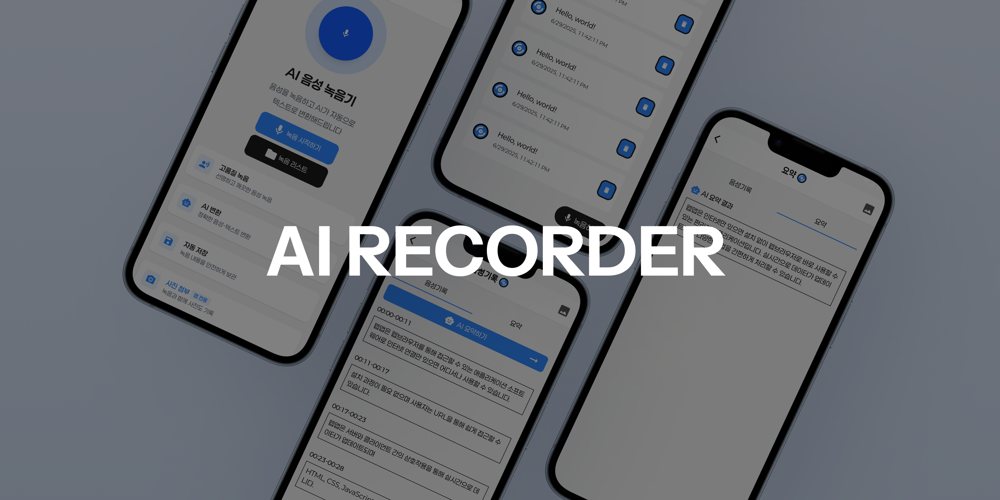
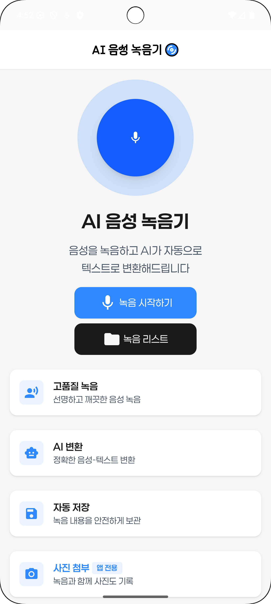
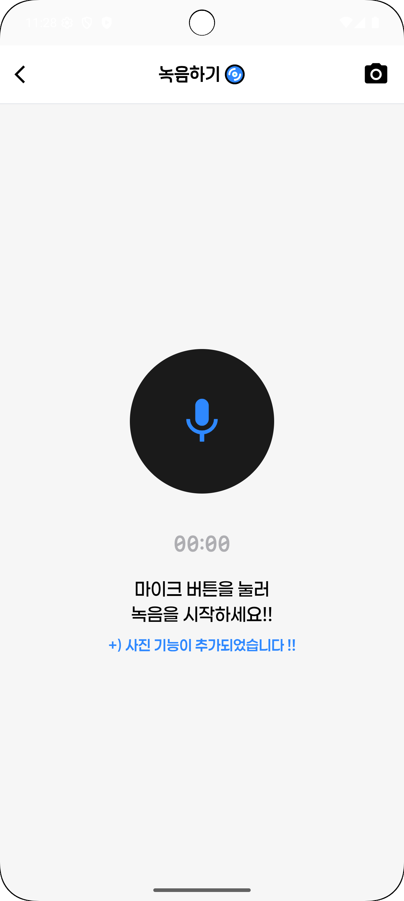
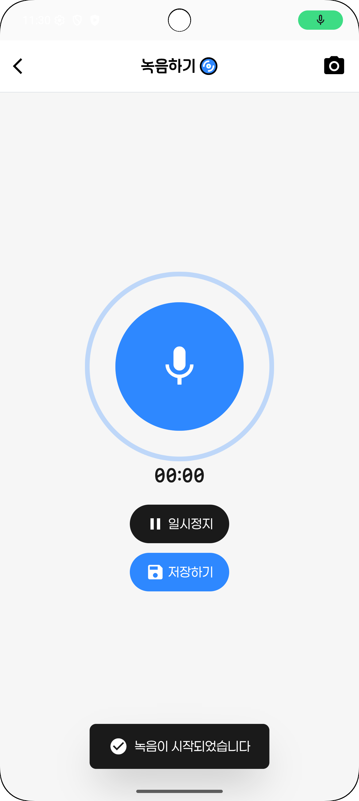
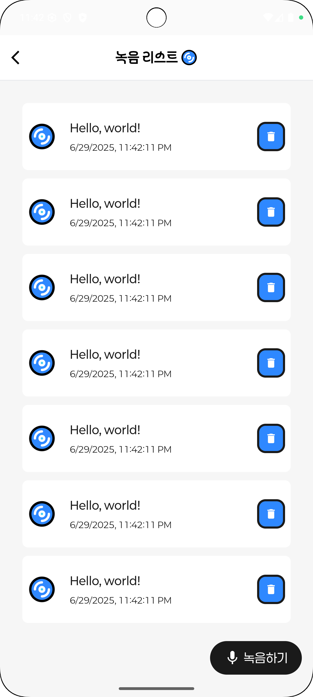
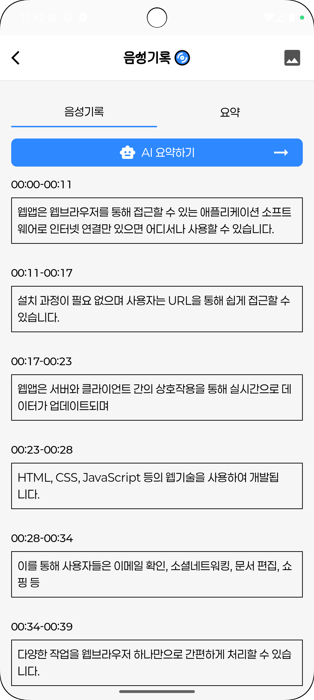
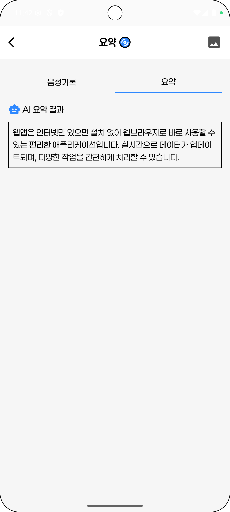
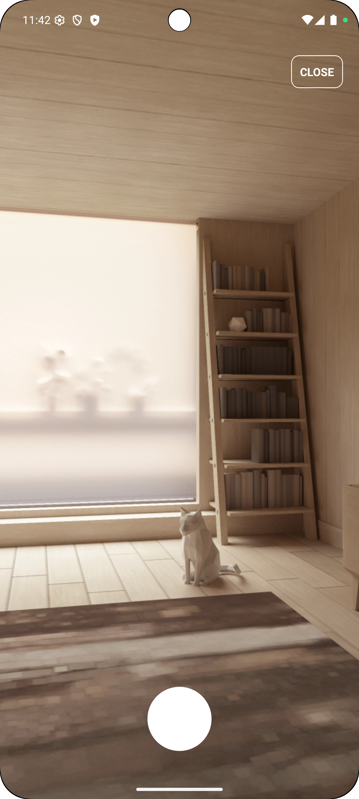
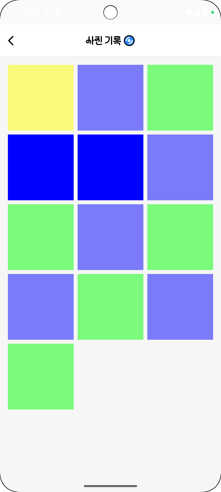

# 🎤AI 음성 녹음기

> **AI 기반 음성 녹음 & 텍스트 변환 서비스**



**음성을 녹음하고 AI가 자동으로 핵심 내용으로 요약 해주는 크로스플랫폼 서비스입니다. <br />
웹과 모바일에서 모두 사용할 수 있습니다.**

## 🛠️ 기술 스택

### Web

- React 19
- TypeScript
- TailwindCSS

### Mobile

- React Native
- TypeScript

## 📱 주요 기능

- 🎙️ **음성 녹음**
  - 웹: MediaRecorder Web API
  - 모바일: react-native-audio-recorder-player
- 🤖 **AI 변환 및 요약** : Whisper API (음성→텍스트) + ChatGPT API (요약)
- 📸 **사진 촬영** : react-native-vision-camera

- 🔄 **크로스플랫폼** : 웹/모바일 지원

## 📱 화면 구성

<div align="center">

|                          홈 화면                           |                           녹음 화면                            |                             녹음 중                             |
| :--------------------------------------------------------: | :------------------------------------------------------------: | :-------------------------------------------------------------: |
|  |  |  |
|                         메인 화면                          |                           음성 녹음                            |                         녹음 애니메이션                         |

|                              녹음 목록                              |                               녹음 상세                               |                          텍스트 변환                          |
| :-----------------------------------------------------------------: | :-------------------------------------------------------------------: | :-----------------------------------------------------------: |
|  |  |  |
|                          저장된 녹음 목록                           |                           AI 음성 변환 결과                           |                         AI 요약 결과                          |

|                          사진 촬영                          |                            사진 목록                             |
| :---------------------------------------------------------: | :--------------------------------------------------------------: |
|  |  |
|                          사진 촬영                          |                     사진 갤러리 & 모달 뷰어                      |

</div>

---

## 📂 프로젝트 구조

```
📦ai-recorder/
  ├─ 📂ai-recorder-web/      # 웹 프론트엔드
  └─ 📂AIRecorderApp/        # 모바일 앱(React Native)
```

## 💡 핵심 아키텍처

### 웹-모바일 통신

```javascript
// 웹 → 모바일 메시지 전송
window.ReactNativeWebView?.postMessage(JSON.stringify({
  type: 'start-record',
  data: { ... }
}));

// 모바일 → 웹 메시지 수신
window.addEventListener('message', (event) => {
  const { type, data } = JSON.parse(event.data);
  // 녹음 데이터, 사진 데이터 등 처리
});
```
